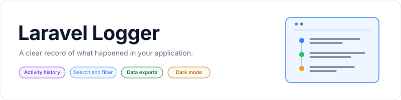

<p align="center">
    <picture>
        <source media="(prefers-color-scheme: dark)" srcset="art/banner-dark.svg">
        <source media="(prefers-color-scheme: light)" srcset="art/banner-light.svg">
        
    </picture>
</p>

<p align="center">Activity logging and a searchable activity dashboard for Laravel applications.</p>

<p align="center">
    <a href="https://github.com/jeremykenedy"></a>
    <a href="https://github.com/jeremykenedy/laravel-logger/stargazers"></a>
    <a href="https://github.com/sponsors/jeremykenedy"></a>
    <a href="https://packagist.org/packages/jeremykenedy/laravel-logger"></a>
    <a href="https://packagist.org/packages/jeremykenedy/laravel-logger"></a>
    <a href="https://github.com/jeremykenedy/laravel-logger/actions/workflows/tests.yml"></a>
    <a href="https://github.styleci.io/repos/109630720"></a>
    <a href="LICENSE"></a>
</p>

## Table of Contents

- [Framework Support](#framework-support)
- [Requirements](#requirements)
- [Installation](#installation)
- [Quick Start](#quick-start)
- [Features](#features)
- [Configuration](#configuration)
- [Changing Frameworks](#changing-frameworks)
- [Artisan Commands](#artisan-commands)
- [Testing](#testing)
- [License](#license)

## Framework Support

| Choice | Dashboard | Default |
|--------|-----------|---------|
| Bootstrap 4 and Blade | Existing views, including published overrides | Yes |
| Bootstrap 3 and Blade | Existing panel-based views | No |
| Bootstrap 5 and Blade | Modern dashboard with dark mode | No |
| Tailwind CSS and Blade | Modern dashboard with dark mode | No |

`composer update` does not switch frameworks or replace your views or configuration. The default remains Bootstrap 4 with the existing Blade views. Modern views can also be selected explicitly for Bootstrap 3 or 4.

The test matrix covers Laravel 8 through 13, including Laravel 8 on PHP 7.3. The Composer runtime PHP constraint is unchanged. The existing anonymous migration requires Laravel's anonymous migration loader, available in Laravel 8.37 and later. Earlier framework installations are historical compatibility targets, not newly verified by this matrix. Cursor pagination requires a Laravel version that provides `cursorPaginate`.

The dashboard is rendered by Blade. Livewire, Vue, React, and Svelte applications can link to it without installing another frontend runtime. This package does not ship separate client-side dashboards.

## Requirements

- A Laravel application with authentication and a database connection.
- A parent Blade layout, `layouts.app` by default.
- Bootstrap or Tailwind assets in the host application. The modern Bootstrap 5 views can load Bootstrap CSS from a CDN when `enableBootstrapCssCDN` is enabled.
- PHP's zip and XMLWriter extensions for Excel exports.

## Installation

```bash
composer require jeremykenedy/laravel-logger
php artisan logger:install
php artisan migrate
```

The installer detects an existing `config/laravel-logger.php` and asks before continuing. In unattended deployments, use `logger:update`, or `logger:install --force` to skip that confirmation. Configuration and published view overrides are preserved even with `--force`. Database migrations remain a separate step.

For a modern dashboard:

```bash
php artisan logger:install --css=bootstrap5 --views=modern --theme=system
```

The installer publishes configuration if missing and dashboard assets to `public/vendor/laravel-logger`. Views remain in the package unless `--publish-views` is supplied. Existing `vendor:publish --tag=LaravelLogger` and `LaravelLogger-legacy` language publishing continue to work.

The parent layout must render `content`, `template_linked_css`, and `footer_scripts`, or the section names in your configuration:

```blade
<head>
    @yield('template_linked_css')
</head>
<body>
    @yield('content')
    @yield('footer_scripts')
</body>
```

For layouts using stacks, set `bladePlacement` to `stack` and use `@stack` for the CSS and script placements. The dashboard honors your layout and does not load a second application shell.

Laravel 5.4 and earlier require manual Logger provider registration. Existing Lumen installations should keep their activity middleware registration, copy the configuration, and set `LARAVEL_LOGGER_DISABLE_ROUTES=true`; they do not use the dashboard or the new setup commands.

Crawler detection is included in Laravel Logger. Composer no longer installs `jaybizzle/laravel-crawler-detect` or `jaybizzle/crawler-detect`. Existing manual crawler provider registration, the old crawler facade, and the `LaravelCrawlerDetect` container binding remain supported through compatibility aliases. If your application explicitly requires either package, Composer keeps that dependency and its classes take precedence. Logger preserves custom detector bindings. The bundled patterns are shipped with the package and update when Logger is released.

## Quick Start

Attach the `activity` middleware to routes you want recorded:

```php
Route::get('/dashboard', [DashboardController::class, 'index'])->middleware(['auth', 'activity']);
```

Or use the trait in your controller or service:

```php
use jeremykenedy\LaravelLogger\App\Http\Traits\ActivityLogger;

class AccountController extends Controller
{
    use ActivityLogger;

    public function update()
    {
        $this->activity('Updated account', 'Changed billing address', [
            'id' => 42,
            'model' => Account::class,
        ]);
    }
}
```

Visit `/activity` while signed in. The existing `rolesEnabled` and `rolesMiddlware` settings can restrict the dashboard and exports to an administrative role. Without those settings, any authenticated user has access, matching existing behavior.

Use a regular link from the frontend your application already uses:

```blade
{{-- Blade or Livewire --}}
<a href="{{ route('activity') }}">Activity log</a>
```

```vue
<!-- Vue -->
<a href="/activity">Activity log</a>
```

```jsx
// React
<a href="/activity">Activity log</a>
```

```svelte
<!-- Svelte -->
<a href="/activity">Activity log</a>
```

## Features

- Route middleware, manual activity logging, and configurable authentication listeners.
- Registered users, guests, and built-in crawler detection, including alternate user-agent headers.
- Search by description, user, method, route, and IP address.
- Inclusive date ranges and preset periods, including cursor-paginated lists.
- CSV, JSON, and valid Excel workbook downloads with the same filters as the dashboard.
- Activity details and related user history.
- Clear, restore, and permanently delete cleared logs through existing routes.
- Configurable activity model, user model, user identifier, table, and connection.
- Existing translation namespaces and published view overrides.
- Opt-in modern views with responsive tables, keyboard focus, and light, dark, or system themes.

## Configuration

Published settings live in `config/laravel-logger.php`; package code reads the existing `LaravelLogger` configuration namespace. Missing options in older published config files receive package defaults.

| Option | Default | Purpose |
|--------|---------|---------|
| `cssFramework` | `null` | Retain `bootstapVersion`; otherwise select `bootstrap3`, `bootstrap4`, `bootstrap5`, or `tailwind` |
| `viewStyle` | `legacy` | `legacy` or `modern`; Bootstrap 5 and Tailwind always use modern views |
| `theme` | `system` | Modern views: `system`, `light`, or `dark` |
| `enableThemeToggle` | `true` | Show the modern dashboard theme button (`LARAVEL_LOGGER_THEME_TOGGLE`) |
| `assetUrl` | `/vendor/laravel-logger` | Published dashboard CSS and script URL |
| `loggerBladeExtended` | `layouts.app` | Parent layout |
| `bootstapVersion` | `4` | Existing Bootstrap 3/4 setting; spelling retained |
| `bootstrapCardClasses` | Empty | Existing card classes |
| `bladePlacement` | `yield` | CSS/script sections or `stack` |
| `bladePlacementCss` | `template_linked_css` | CSS placement name |
| `bladePlacementJs` | `footer_scripts` | Script placement name |
| `loggerDatabaseConnection` | `DB_CONNECTION` or `mysql` | Activity database connection |
| `loggerDatabaseTable` | `laravel_logger_activity` | Activity table |
| `defaultActivityModel` | Package `Activity` model | Custom activity model |
| `defaultUserModel` | `App\Models\User` | User model; older applications can keep `App\User` |
| `defaultUserIDField` | `id` | User identifier field |
| `rolesEnabled` | `false` | Enable role middleware |
| `rolesMiddlware` | `role:admin` | Existing role middleware name; spelling retained |
| `loggerMiddlewareEnabled` | `true` | Enable activity middleware |
| `loggerMiddlewareExcept` | Empty array | URI patterns excluded from logging |
| `disableRoutes` | `false` | Register your own package routes |
| `enableSearch` | `false` | Search filters |
| `searchFields` | `description,user,method,route,ip` | Enabled search fields |
| `enableDateFiltering` | `true` | Date filters |
| `enableExport` | `true` | Export UI and endpoint |
| `loggerPaginationEnabled` | `true` | Page-number pagination |
| `loggerCursorPaginationEnabled` | `false` | Cursor pagination |
| `loggerPaginationPerPage` | `25` | Page size |
| `loggerDatatables` | `false` | Legacy DataTables integration |
| `enableSubMenu` | `true` | Dashboard navigation and bulk action controls |
| `enableDrillDown` | `true` | Links to individual activities |
| `enableLiveSearch` | `true` | Legacy user lookup interface |
| `enablePackageFlashMessageBlade` | `true` | Flash messages |
| `logDBActivityLogFailuresToFile` | `true` | Report validation failures to the application log |
| `enableGeoPlugin` | `true` | External IP lookup on detail pages |
| `geoPluginUrl` | GeoPlugin endpoint | Custom IP lookup endpoint |
| `logAllAuthEvents`, `logAuthAttempts` | `false` | Broad authentication logging |
| `logFailedAuthAttempts`, `logLockOut`, `logPasswordReset`, `logSuccessfulLogin`, `logSuccessfulLogout` | `true` | Individual authentication event logging |
| `enablejQueryCDN`, `JQueryCDN` | Enabled, package URL | Legacy jQuery assets |
| `enableBootstrapCssCDN`, `bootstrapCssCDN` | Enabled, Bootstrap 4 URL | Bootstrap CSS; disable when bundled by your application |
| `enableBootstrapJsCDN`, `bootstrapJsCDN` | Enabled, Bootstrap 4 URL | Legacy Bootstrap script |
| `enablePopperJsCDN`, `popperJsCDN` | Enabled, package URL | Legacy Popper script |
| `enableFontAwesomeCDN`, `fontAwesomeCDN` | Enabled, package URL | Legacy icon font |
| `loggerDatatablesCSScdn`, `loggerDatatablesJScdn`, `loggerDatatablesJSVendorCdn` | Package URLs | Legacy DataTables assets |

Modern views do not load jQuery, Bootstrap JavaScript, Popper, Font Awesome, or DataTables. A single theme button cycles through light, dark, and system mode. It displays the sun, moon, or monitor icon for the selected mode. Set `enableThemeToggle` to `false` in `config/laravel-logger.php`, or set `LARAVEL_LOGGER_THEME_TOGGLE=false`, to hide it. System mode follows changes to the device's color scheme. The selected mode is saved for this dashboard, independently of the host application's theme. Explicit light or dark configuration takes precedence on page load.

IP logging uses Laravel's trusted-proxy configuration. Configure trusted proxies in the host application when traffic passes through Cloudflare or a load balancer.

Filter and export examples:

```text
/activity?date_from=2026-10-01&date_to=2026-10-07
/activity?period=last_7_days&description=Updated
/activity/export?format=csv&period=today
/activity/export?format=json&user=42
/activity/export?format=excel&method=POST
```

All dashboard, lookup, export, clear, restore, and delete routes retain `web`, `auth`, and `activity` middleware. Route names remain `activity`, `cleared`, `clear-activity`, `destroy-activity`, `restore-activity`, `liveSearch`, and `export-activity`.

## Changing Frameworks

Run the interactive updater:

```bash
php artisan logger:update
```

Or pass the choices directly:

```bash
php artisan logger:update --css=bootstrap5 --views=modern --theme=system
php artisan logger:switch --css=tailwind
php artisan logger:switch --css=bootstrap4 --views=legacy
```

| Option | Values | Purpose |
|--------|--------|---------|
| `--css` | `bootstrap3`, `bootstrap4`, `bootstrap5`, `tailwind` | CSS framework |
| `--views` | `legacy`, `modern` | View set |
| `--theme` | `system`, `light`, `dark` | Modern dashboard theme |
| `--frontend` | `blade` | Existing server-rendered frontend |
| `--publish-views` | Flag | Copy missing views without overwriting custom views |

The update command preserves configuration and view overrides while refreshing package assets. The switch command makes the same validated setting changes without prompts. These commands use your application's configured environment file and do not install npm packages or optional Laravel packages. Run `php artisan config:clear` first if configuration is cached, then rebuild that cache after switching.

After switching, run `npm run build` in applications that bundle their CSS. Tailwind needs to scan both the views and the PHP class strings. For Tailwind 4, add these paths relative to `resources/css/app.css`:

```css
@source "../../vendor/jeremykenedy/laravel-logger/src/resources/views";
@source "../../vendor/jeremykenedy/laravel-logger/src/Support/Dashboard.php";
```

For Tailwind 3, add those paths to `content` in `tailwind.config.js`. Disable `enableBootstrapCssCDN` if your layout already bundles Bootstrap. Optional UI packages can remain in your application's layout; Logger does not require them or change their configuration.

## Artisan Commands

| Command | Description | Options |
|---------|-------------|---------|
| `logger:install` | Publish missing configuration and install dashboard assets; detect existing installation | `--css`, `--frontend`, `--views`, `--theme`, `--publish-views`, `--force` |
| `logger:update` | Update assets and choose framework settings interactively | Same options |
| `logger:switch` | Change settings through flags without prompts | Same options |

Install options:

| Flag | Description |
|------|-------------|
| `--css=` | `bootstrap3`, `bootstrap4`, `bootstrap5`, or `tailwind` |
| `--frontend=` | `blade`; other frontends use links to the existing dashboard |
| `--views=` | `legacy` or `modern` |
| `--theme=` | `system`, `light`, or `dark` |
| `--publish-views` | Publish missing view files; preserve existing files |
| `--force` | Skip the existing-installation confirmation; does not overwrite config or views |
| `--no-interaction` | Use supplied options and current settings |

The existing publish tags remain available. `LaravelLogger-config`, `LaravelLogger-views`, and `LaravelLogger-assets` allow individual publishing. Use `vendor:publish --tag=LaravelLogger-views --force` only when you intentionally want to replace view customizations.

## Testing

```bash
composer install
composer test
composer lint
composer analyse
npm ci
npm run test:browser
```

Tests run against an isolated SQLite database through Orchestra Testbench. See [TESTING.md](TESTING.md) for the matrix, browser fixture, and coverage commands. [FEATURES.md](FEATURES.md) describes filtering and export behavior. The existing [video tour](https://youtu.be/mHLSv9XhTuk) and [legacy dashboard screenshots](https://s3-us-west-2.amazonaws.com/github-project-images/laravel-logger/1-dashboard.jpg) remain useful for applications using the original views.

The bundled crawler pattern and test data notices are in [THIRD_PARTY_LICENSES.md](THIRD_PARTY_LICENSES.md).

Scrutinizer analysis: [project dashboard](https://scrutinizer-ci.com/g/jeremykenedy/laravel-logger/).

## License

This package is open-sourced software licensed under the [MIT license](LICENSE).
